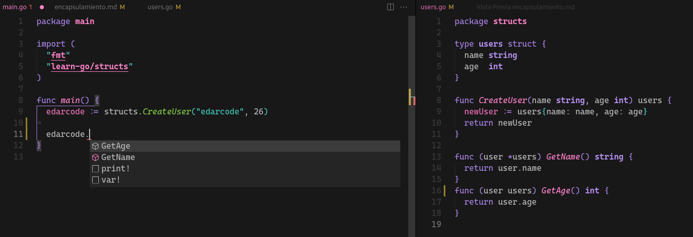

# Encapsulamiento

Se sabe que para encapsular o privatizar basta con colocar todo en minuscula. Creemos una struct "users" y privaticemos todas sus variables igualmente.

```
package structs

type users struct {
	name string
	age  int
}
```

Cree una función que pueda inicializar una instancia de la struct "users". Note que la func no está asociada a al struct, sin embargo, tiene el poder de crear una instancia de "users" y devolverla.

```
func CreateUser(name string, age int) users {
	newUser := users{name: name, age: age}
	return newUser
}
```

Para consumir sería:

```
package main

import (
	"fmt"
	"learn-go/structs"
)

func main() {
	edarcode := structs.CreateUser("edarcode", 26)
	fmt.Println(edarcode) // {edarcode 26}
}
```

Si intenta acceder a alguna propiedad de la **struct** no podrá. Lo ideal es crear funciones get que permitan obtener dichos campos. Como es una operación de lectura no es necesario usar punteros.

```
func (user *users) GetName() string {
	return user.name
}

func (user users) GetAge() int {
	return user.age
}
```

Para consumir sería:



```
package main

import (
	"fmt"
	"learn-go/structs"
)

func main() {
	edarcode := structs.CreateUser("edarcode", 26)
	fmt.Println(edarcode.GetName()) // edarcode
	fmt.Println(edarcode.GetAge())  //26
}
```
