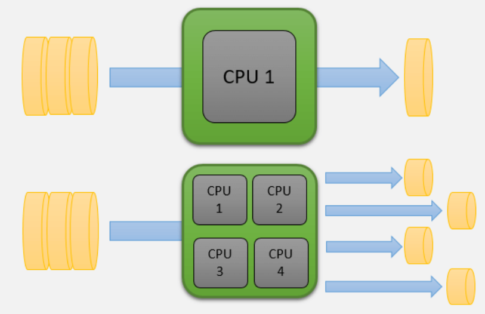
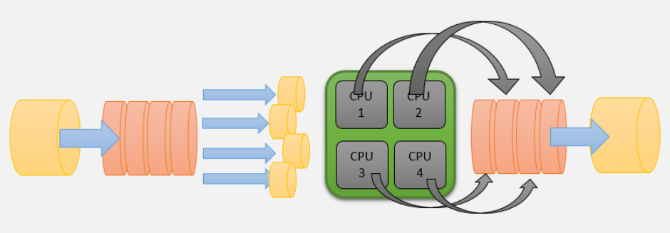

# ¿Qué es la concurrencia?

Es la capacidad del CPU para procesar más de un proceso al mismo tiempo.

Un procesador puede procesar al mismo tiempo el mismo número de procesos que el número de **nucleos** que tiene, de esta forma, si un procesador tiene un **nucleo**, entonces solo podrá ejecutar un proceso a la vez, por otro parte, si tenemos 8 nucleos, entonces podremos ejecutar hasta 8 procesos al mismo tiempo.

los procesos en ejecución no tienen por qué estar relacionados, es decir, cualquiera puede iniciar y terminar en el momento que sea, y el resultado de uno no afecta al otro.

# Paralelismo

Sigue la filosofía de “divide y vencerás”, consiste en tomar un único problema, y mediante concurrencia llegar a una solución más rápido. Toma el problema inicial, lo divide en fracciones más pequeñas, y luego cada fracción es procesada de forma concurrente, aprovechando al máximo la capacidad del procesador para resolver el problema.

La principal diferencia paralelismo vs concurrencia es que, en el paralelismo, todos los procesos concurrentes están íntimamente relacionados a resolver el mismo problema, de tal forma que el resultado de los demás procesos afecta al resultado final.

Además, existe un paso final que se encarga de unir los resultados de todos los procesos para poder arrojar un resultado final.

## Conclusión

**La concurrencia lidia con múltiples tareas al mismo tiempo, mientras que el paralelismo está haciendo múltiples tareas al mismo tiempo xD.**
