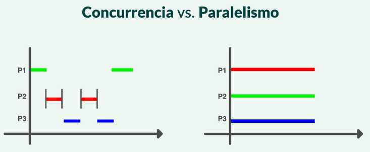

# ¿Qué es la concurrencia?

**La concurrencia lidia con múltiples tareas al mismo tiempo, mientras que el paralelismo está haciendo múltiples tareas al mismo tiempo.**

Cada que ejecutamos una tarea va a parar al procesador y el mismo va a realizarla en uno de sus hilos disponibles.

Imaginemos que se necesitan realizar 2 tareas y la primera tarea debe repetirse 3 veces y hagamos un **vs**.

## Paralelismo

El procesador empieza por al primera tarea y crea 3 hilos, c/u agarra 1 ciclo, cada hilo espera termina su ciclo y una vez terminado lo anuncia y así mismo para cada hilo. Al terminar la primera tarea va a la siguiente.

En conclusión, el paralelismo hace muchas cosas al tiempo, pero no muchas tareas al tiempo, le toca esperar a que termine en la que esté para ir a la sgt.

## Concurrencia

No se queda esperando a terminar la primera tarea, si no que avanza a la sgt sin mente y repite el proceso con cada tarea.

En conclusión, la concurrencia hace muchas cosas y muchas tareas al mismo tiempo 😎.

