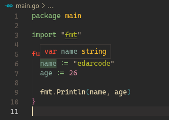
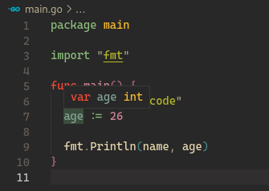

# Variables

Puente definir variables de varias formas, go incluso es inteligente e infiere lo obvio.




Explicitamente sería

```
package main

import "fmt"

func main() {
	var name string = "edarcode"
	var age int = 26

	fmt.Println(name, age)
}
```
