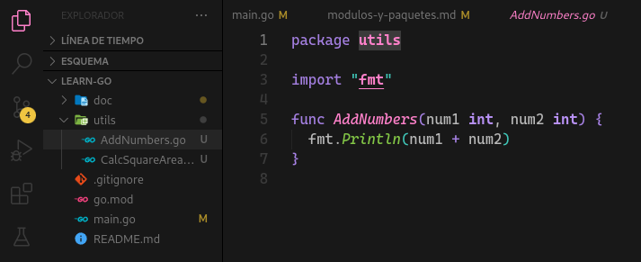
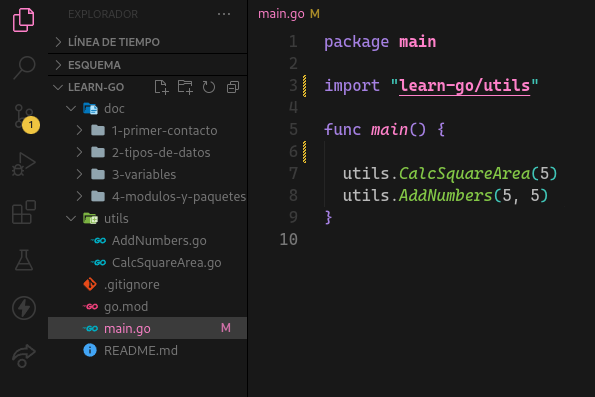

## Módulos

Para definir un modulo y dividir el mismo en paquetes (folders) debe ubicarse en la raíz de su proyecto, luego por consola ejecute "go mod init" y listo, en su proyecto debe estar un archivo "go.mod".

## Paquetes

Por defecto cada carpeta en su proyecto representa un scope de paquete Creemos un carpeta, por ej "utils" y dentro podrá crear tantos archivos como desee.

Todos los archivos comparten el scope, intente crear 2 funciones con el mismo nombre en distintos archivos y lo entenderá.

Lo ideal es poner como nombre de paquete el nombre de la carpeta que lo representa. A partir de aquí todo lo que tenga un nombre que inicie con mayúscula será publico y minúscula privado.

Para acceder a cualquier cosa de otro paquete se deberá importar el paquete y acceder con la notación de punto al recurso.

Si desea consumir los recursos d
el paquete debe nombrar el mismo con mayúscula. Todos los archivos dentro de utils comparten el mismo scope.

